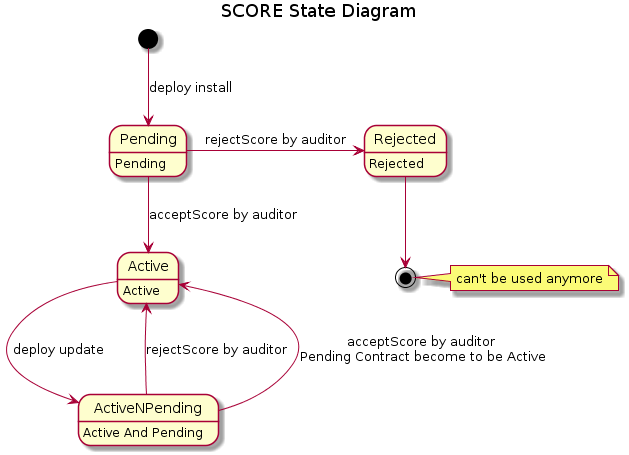
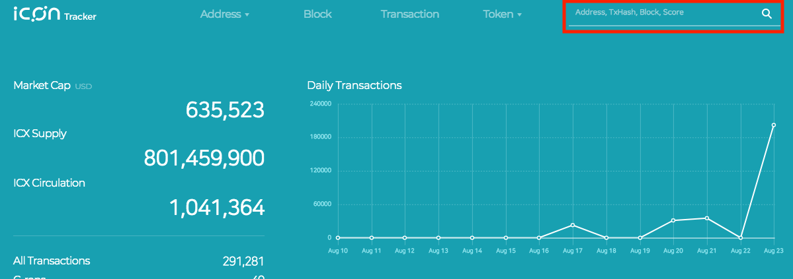
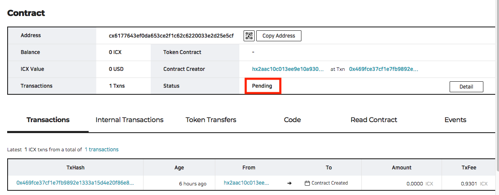
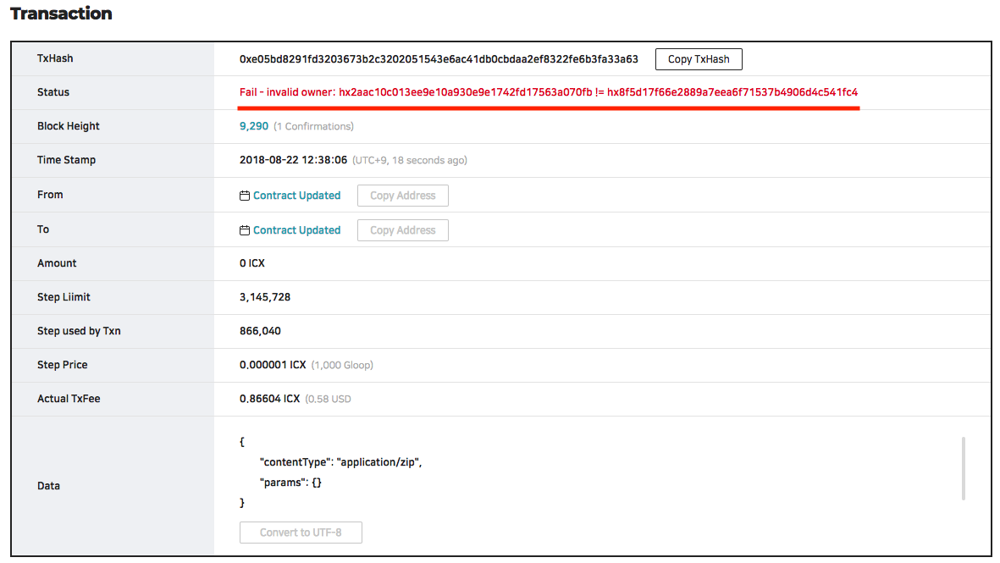

# Guide de déploiement de SCORE
Ce document expliquera le processus de déploiement de SCORE (*Smart Contract on Reliable Environment*, Smart Contract sur un Environnement Sûr) dans le réseau d'ICON.

La distribution de SCORE est rendue possible à travers T-Bears, and les développeurs de DAPP auront besoin d'un portefeuille afin de payer les frais de transaction. La mise à jour d'un SCORE qui a déjà été distribué est rendu possible en utilisant le même portefeuille.

SCORE, qui est exécuté sur le réseau d'ICON, peut attaquer le réseau d'ICON que ça soit intentionnellement ou par erreur. Par conséquent, le réseau d'ICON se sert de l'audit du SCORE pour prévenir des attaques en amont. L'audit de SCORE est effectué sur le mainnet seulement.

Les auditeurs d'ICON conduisent une pré-investigation du SCORE déployé par les développeurs de DAPP afin de déterminer les facteurs de risques. Le SCORE peut être dans un état "accepté" ou "rejeté", et seulement les SCORE qui ont été "acceptés" par l'auditeur peuvent opérer sur le réseau d'ICON.

Ci-dessous est représenté le diagramme d'état d'un SCORE. Si un développeur de DAPP demande le déploiement d'un SCORE à travers T-Bears, le SCORE sera enregistré comme "en attente" dans le réseau d'ICON. Il sera installé seulement après avoir été accepté par un auditeur. S'il est déterminé qu'il représente une menace pour le réseau d'ICON, l'auditeur rejettera le SCORE. Une fois activé, le déployeur original peut mettre à jour le SCORE, et le SCORE précédent restera actif tant que le nouveau est en état d'attente de validation.



## Préparation
Afin que le développeur de DAPP déploie un SCORE, le développeur doit obtenir un portefeuille avec un montant suffisant pour couvrir les frais de transaction.

## T-Bears
Veuillez vous référer au [tutorial de la suite de développement T-Bears](https://github.com/icon-project/t-bears/blob/master/README.md) et installez le.

### Portefeuille
Vous pouvez créer une portefeuille avec ICONex.

ICONex peut être téléchargé dans le menu "Wallet" de https://icon.foundation et installé en tant qu'extension de Chrome. Vous pouvez déposer un certain montant d'ICX, et les frais de transaction seront déduit de votre solde. Après avoir créé votre portefeuille, vous pouvez faire une sauvegarde de votre fichier keystore, ce dernier étant utilisé lorsque vous déployez le SCORE depuis l'interface de commande de T-Bears.


Le fichier de keystore peut être également créé avec T-Bears, dans ce cas, vous pourrez importer le keystore dans ICONex.

```bash
(work) $ tbears keystore key_DAPPDEV.txt

input your key store password:

Made keystore file successfully

```


### Tracker
ICON fournit un tracker (https://tracker.icon.foundation/) qui vous permet d'accéder au status de n'importe quel bloc et transaction.



## Déploiement

### tbears deploy install
Ouvrez le fichier `tbears_cli_config.json`, et assurez vous que les valeurs de `keyStore`, `contentType`, `mode` et `uri` sont correctes.

Dans `uri`, vous devez renseigner l'URI du Mainnet, tandis que dans `keyStore`, vous devez mettre le chemin du keystore.

```text
{
"uri": "http://wallet.icon.foundation:9000/api/v3",
"nid": "0x3",
"keyStore": "key_DAPPDEV.txt",
"from": "hxaaaaaaaaaaaaaaaaaaaaaaaaaaaaaaaaaaaaaaaa",
"to": "cx0000000000000000000000000000000000000000",
"stepLimit": "0x300000",
"deploy": {
    "contentType": "zip",
    "mode": "install",
    "scoreParams": {}
},
"txresult": {},
"transfer": {}
}

```

Déployez le SCORE de votre choix. Dans ce qui suit, le SCORE nommé "abc" est déployé.

```bash
(work) $ tbears deploy abc

input your key store password:

Send deploy request successfully.

transaction hash: 0x469fce37cf1e7fb9892e1333a15d4e20f86e8f010b56fe0708bd89246dedcfbf
```

Vous pouvez vérifier le résultat du déploiement du SCORE grâce au hash de la transaction (le résultat de la commande ci-dessus) dans le tracker. 

Si vous choisissez "Contract Created" dans l'écran ci-dessus, vous pouvez vérifier le status de l'audit de votre SCORE. Le status est "*pending*" (en attente) jusqu'à ce que l'auditeur l'accepte.



Sur T-Bears, vous pouvez aussi récupérer le résultat de la transaction grâce au hash de la transaction. Dans le résultat, vous pouvez récupérer l'adresse du SCORE dans le champ `scoreAddress` comme montré dans l'exemple ci-dessous. Notez que l'adresse du SCORE est assignée avant de passer l'audit, cela ne veut pas dire qu'il a déjà été accepté.

```bash
(work) $ tbears txresult 0x469fce37cf1e7fb9892e1333a15d4e20f86e8f010b56fe0708bd89246dedcfbf
 Transaction result: {
     "jsonrpc": "2.0",
     "result": {
         "txHash": "0x469fce37cf1e7fb9892e1333a15d4e20f86e8f010b56fe0708bd89246dedcfbf",
         "blockHeight": "0x1",
         "blockHash": "0x2e7012a444a49b69e7e31a6b8a5f7a38f7bd860ec5fcf896b15416169d1dc924",
         "txIndex": "0x0",
         "to": "cx0000000000000000000000000000000000000000",
         "scoreAddress": "cx7990f4e8e224e238f5eca089ebf48c5351b7ce30",
         "stepUsed": "0x216ee30",
         "stepPrice": "0x0",
         "cumulativeStepUsed": "0x216ee30",
         "eventLogs": [],
         "logsBloom": "0x00000000000000000000000000000000000000000000000000000000000000000000000000000000000000000000000000000000000000000000000000000000000000000000000000000000000000000000000000000000000000000000000000000000000000000000000000000000000000000000000000000000000000000000000000000000000000000000000000000000000000000000000000000000000000000000000000000000000000000000000000000000000000000000000000000000000000000000000000000000000000000000000000000000000000000000000000000000000000000000000000000000000000000000000000000000",
         "status": "0x1"
     },
     "id": 1
}
```
Vous pouvez remarquer que le résultat ci-dessus de la commande `tbears txresult` ne retourne pas le status de l'audit. De plus, si vous lancez `tbears scoreapi` en utilisant l'adresse du SCORE, et que le SCORE n'est pas actif (en attente ou rejeté), un message d'erreur similaire à celui ci-dessous sera retourné.

```bash
(work) $ tbears scoreapi cx6177643ef0da653ce2f1c62c6220033e2d25e5cf
Can not get cx6177643ef0da653ce2f1c62c6220033e2d25e5cf's API
{
    "jsonrpc": "2.0",
    "error": {
        "code": -32602,
        "message": "SCORE is inactive: cx1e0135cff7fa06be17840badc9ad7144b4c82606"
    },
    "id": 1   
}
```

Puisque vous ne pouvez pas consulter le status de votre SCORE en utilisant la ligne de commande de tbears jusqu'à ce que le SCORE soit actif, en attendant vous pouvez vérifier le status de l'audit sur le tracker.
Le status du SCORE deviendra 'active' seulement lorsque l'auditeur accepte le résultat de l'audit.


Une fois actif, `tbears scoreapi` retournera un résultat valide comme montré ci-dessous (le résultat réel peut varier selon l'implementation). Passé ce point, le SCORE est opérationnel sur le réseau d'ICON.

```
(work) $ tbears scoreapi cx6177643ef0da653ce2f1c62c6220033e2d25e5cf
SCORE API: [
    {
        "type": "fallback",
        "name": "fallback",
        "inputs": []
    },
    {
        "type": "function",
        "name": "hello",
        "inputs": [],
        "outputs": [
            {
                "type": "str"
            }
        ],
        "readonly": "0x1"
    }
]
```

### tbears deploy update

### tbears deploy update
Le déployeur initial peut mettre à jour son SCORE.

Vous pouvez exécuter la commande `tbears deploy` avec l'option -m, ou changer le mode 'deploy' sur 'update' dans le fichier 'tbears_cli_config.json'.

```text
"deploy": {
    "mode": "update",
}
```

```bash
(work) $ tbears deploy -m update -o cx6177643ef0da653ce2f1c62c6220033e2d25e5cf abc

input your key store password:

Send deploy request successfully.

transaction hash: 0x95fd26a68ea60fe223a9a80cf5a54ab0cb7a895d65fa4836a2fc74380b230c54
```


Si vous cliquez sur "Contract Updated" dans l'écran ci-dessus, vous pouvez voir les détails du SCORE. Vous pouvez voir l'état du SCORE courant qui est "active". Dans la liste des transactions, vous pouvez voir "Contract Updated", ce qui veut dire qu'il est dans un état "pending" (en attente). Une fois que l'audit est terminé, "Contract Accepted" ou "Contract Rejected" devrait apparaître.


## Audit Rejeté
Lorsque le SCORE est rejeté par l'auditeur, le status du SCORE devient "Rejected". Vous pouvez vérifier le status dans les détails du contract dans le tracker.


Vous pouvez voir la raison détaillée du rejet dans la transaction.


Si la mise à jour du SCORE est rejetée, la version du SCORE précédente reste active.

## Erreurs courantes
1. Vous ne pouvez pas payer les frais de transaction 

```bash
(work) $ tbears deploy abc

input your key store password:

Got an error response
{'jsonrpc': '2.0', 'error': {'code': -32600, 'message': 'Out of balance'}, 'id': 1}
```

2. Seulement le déployeur initial peut mettre à jour le SCORE. Si vous utilisez un portefeuille différent en utilisant `deploy update`, l'erreur suivante apparaîtra 
3. Si vous utilisez `deploy update` sur un SCORE qui n'est pas actif, l'erreur suivante apparaîtra 
```bash
(work) $ tbears deploy -m update -o cx06a427d41e87612c27c3caa2f1d7444c69781dc9  abc

input your key store password:

Got an error response

{'jsonrpc': '2.0', 'error': {'code': -32600, 'message': 'cx06a427d41e87612c27c3caa2f1d7444c69781dc9 is inactive SCORE'}, 'id': 1}

```

--
[Document de référence](https://github.com/icon-project/icon-project.github.io/blob/861ef5bc09c75a367150b40d89def84c57c0ccc9/docs/score_deploy_guide.md)